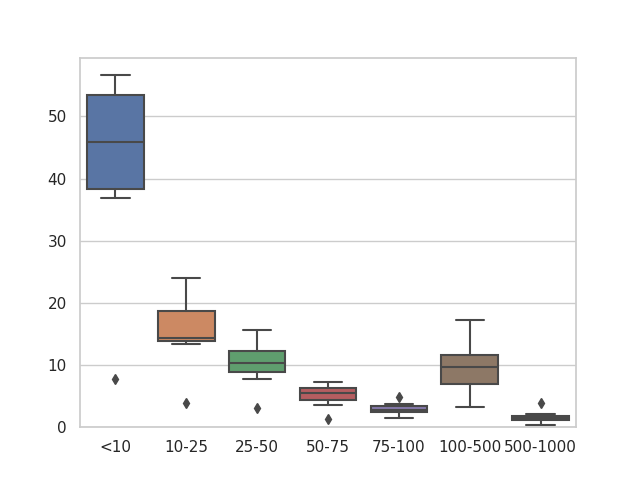

# 实验报告超光谱图像重建

## 深度先验高斯混合模型
* 训练批次为220 epochs, 实验结果和论文中的结果基本吻合。
<table>
<tr>  <td>测试图</td>  <td>ssim</td> <td>psnr</td> </tr>

<tr>  <td>1</td>  <td>0.9091989198179372</td> <td>32.87924279116148</td> </tr>
<tr>  <td>2</td>  <td>0.8822578151050889</td> <td>31.475772656454104</td> </tr>
<tr>  <td>3</td>  <td>0.9007396889999394</td> <td>30.299819746207888</td> </tr>
<tr>  <td>4</td>  <td>0.9620528900828241</td> <td>35.69557114114804  </td> </tr>
<tr>  <td>5</td>  <td>0.8841863123860482</td> <td>29.522616159650692</td> </tr>
<tr>  <td>6</td>  <td>0.9324467490316122</td> <td>32.55514161900324</td> </tr>
<tr>  <td>7</td>  <td>0.8799889761277078</td> <td>30.3468706761289</td> </tr>
<tr>  <td>8</td>  <td>0.9252564787876315</td> <td>30.767236507527773</td> </tr>
<tr>  <td>9</td>  <td>0.9071426160482012</td> <td>30.2788981761727</td> </tr>
<tr>  <td>10</td>  <td>0.9303049631603824</td> <td>30.59358326167578</td> </tr>
<tr>  <td>AVG</td>  <td>0.9114</td>            <td>31.2415</td> </tr>
</table>

* 进行了连通域的分析，下图表示预测和GT之间不一样的连通域面积。 X轴是阈值 Y轴是连通域个数，比如连通域面积在10像素以内的连通域个数 连通域面积在10-25像素之间的连通域个数。表示主要问题集中在图像重建的细节部分。
<table>
<tr>  <td></td> <td></td> </tr>
</table>

### 未来几天计划
* 周六周日再阅读一些资料，周一之前完成想法的大致描述使用PPT
* 分析一些该方法实验结果不好的原因，更具体什么样的原因导致细节重建不够真实和清晰。
